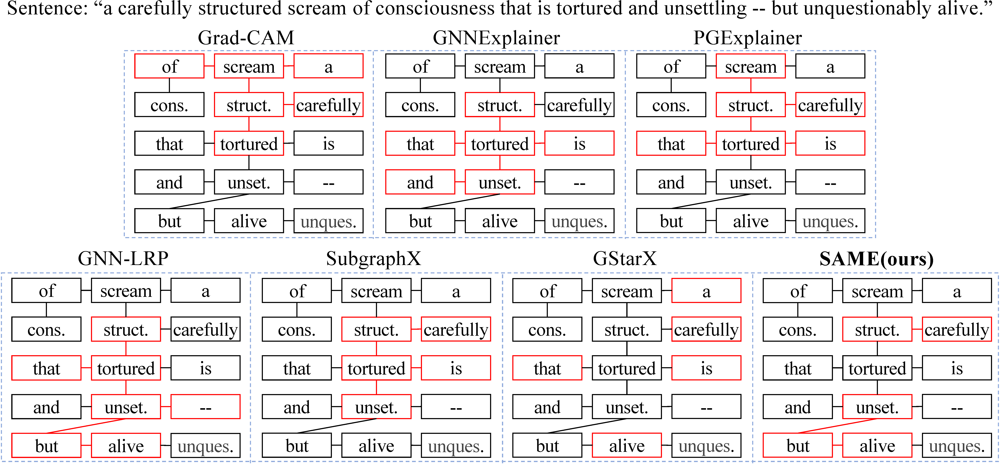
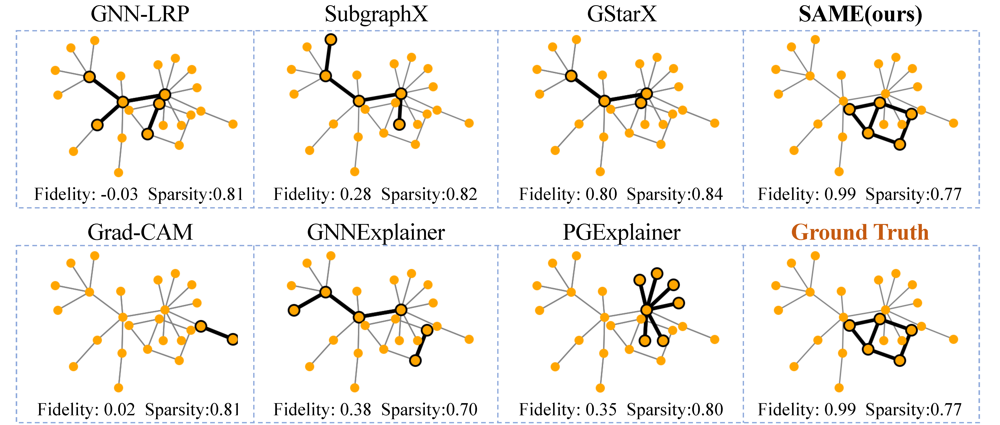

# <u>S</u>tructure-<u>A</u>ware Shapley-based  <u>M</u>ultipiece <u>E</u>xplanation (SAME)

Code for SAME: Uncovering GNN Black Box with Structure-aware Shapley-based  Multipiece Explanations

## How Can SAME Uncover GNN Black Box -- A Qualitative Analysis

### Explanation on the sentiment graphs: `Graph-SST2` dataset

SAME can well capture the adjectives-or-adverbs-like graph structures than other baselines. 

<p align="center">
  <br />
  
  <br />
</p>


### Explanation on the molecular graphs: `MUTAG` dataset

SAME achieves to provide the explanations the same as the ground truth which are labelled by human experts. 

<p align="center">
  <br />
  
  <br />
</p>


### Explanation on the synthetic Barabási–Albert graphs: `BA-2Motifs` dataset

SAME exactly finds the ground-truth explanation (a 5-node-house-structure motif) compared to other baselines.

<p align="center">
  <br />
  
  <br />
</p>


## Getting Started

### Requirements

```bash
pip install -r requirements.txt
```

### Datasets

For the datasets used in our paper, please download them manually and move them into the folder `datasets/`. The file name is **case sensitive** and please make sure that all of the file names are in **lowercase**. For more information about the datasets, please refer to `dataset.py`. 

Here we provide the link to download them. 

### Models

Please use the following `bash` script to train the GNN models. Our code contains the implementation of `GCN`, `GAT` and `GIN`. The trained checkpoints of these models will be saved in `checkpoints/`.

```bash
python train_gnns.py models='gcn' datasets='mutag'
```

### Usage

- Train GNNs before explaining.
  - The `models` argument can be chosen from `GCN`, `GAT` or `GIN`. And you can create your own GNN model in `getNets.py`. 
  - For other datasets and GNNs, please create the corresponding files in `config`. 

```bash
python train_gnns.py datasets=mutag models=gin
```

- One-Click run: use the following script to run the experiments thoroughly. The script will automatically run the experiments in the sparsity $[0.5,0.6,0.7,0.8]$. 

```bash
bash main.sh
```

- Otherwise, you can run one explainer to explain a trained GNN model
  - You can run other baseline methods by setting `explainer` as `gnn_explainer`, `pgexplainer`, `gnn_lrp`, `grad_cam`, `subgraphX`, `gstarx`, `orphicx`, and `graphsvx`

```bash
explainer=same
dataset_name=bbbp
sparsity=0.8
model_name=gcn
python run_one_model.sh $explainer $dataset_name $sparsity $model_name
```

## Results

Comparison of our SAME and other baseline using fidelity. The fidelity results are averaged across different sparsity from 0.5 to 0.8. And they are presented in the form of mean $\pm$ std.

|   Datasets   |            BBBP             |            MUTAG            |         Graph-SST2          |         Graph-SST5          |         BA-2Motifs          |          BA-Shapes          |
| :----------: | :-------------------------: | :-------------------------: | :-------------------------: | :-------------------------: | :-------------------------: | :-------------------------: |
|   Grad-CAM   |       $0.226\pm0.036$       |       $0.261\pm0.018$       |       $0.257\pm0.056$       |       $0.229\pm0.042$       |       $0.472\pm0.010$       |              -              |
| GNNExplainer |       $0.148\pm0.041$       |       $0.188\pm0.031$       |       $0.143\pm0.041$       |       $0.170\pm0.046$       |       $0.442\pm0.026$       |       $0.154\pm0.000$       |
| PGExplainer  |       $0.197\pm0.043$       |       $0.156\pm0.004$       |       $0.219\pm0.040$       |       $0.207\pm0.036$       |       $0.431\pm0.011$       |       $0.135\pm0.020$       |
|   GNN-LRP    |       $0.111\pm0.040$       |       $0.253\pm0.030$       |       $0.103\pm0.042$       |       $0.131\pm0.057$       |       $0.146\pm0.010$       |       $0.155\pm0.000$       |
|  SubgraphX   | $\underline{0.433\pm0.073}$ |       $0.379\pm0.030$       | $\underline{0.262\pm0.027}$ | $\underline{0.283\pm0.042}$ | $\underline{0.493\pm0.003}$ | $\underline{0.181\pm0.005}$ |
|    GStarX    |       $0.117\pm0.043$       | $\underline{0.656\pm0.096}$ |       $0.183\pm0.050$       |       $0.186\pm0.050$       |       $0.476\pm0.014$       |              -              |
|   **SAME**   |  $\mathbf{0.489\pm0.034}$   |  $\mathbf{0.702\pm0.125}$   |  $\mathbf{0.373\pm0.042}$   |  $\mathbf{0.393\pm0.022}$   |  $\mathbf{0.549\pm0.004}$   |  $\mathbf{0.214\pm0.000}$   |

## Reference

The baseline methods of our code is borrowed from the following repositories. We acknowledge their implementations. 

https://github.com/ShichangZh/GStarX

https://github.com/divelab/DIG/tree/main/dig/xgraph

## Contact Us

If you have any questions, please contact [xxx@xxx.xxx]() or open an issue.  

